# my-LightCuts

Implementation of Lightcuts algorithm

[Link to github](https://github.com/KiK0S/my-lightcuts)

## Build

This is a project on codebase of MyRenderer, so building is the follows:

```
mkdir build
cd build
cmake ..
cd ..
cmake --build build
```


## Run

You can run an arbitrary scene, but scenes with lightcuts configuration are these 3 demos:

```
build/MyRenderer desk
build/MyRenderer desk-red
build/MyRenderer bedroom
```

## Demo, benchmarks

|Demo name|Rendering method|Time elapsed|Lights evaluated|Image|
|:---:|:---:|:---:|:---:|:----:|
|bedroom|Rasterizer| 0s | 216 | 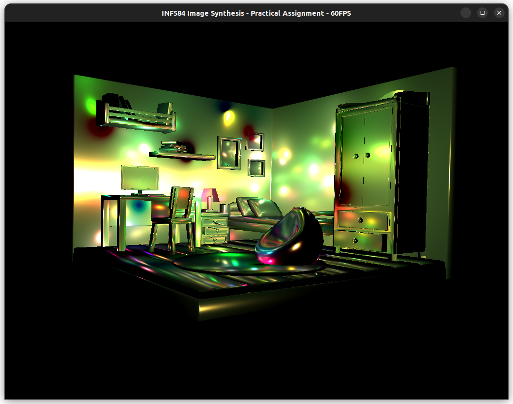|
|bedroom|Ray tracer| 1h26m | 100 | 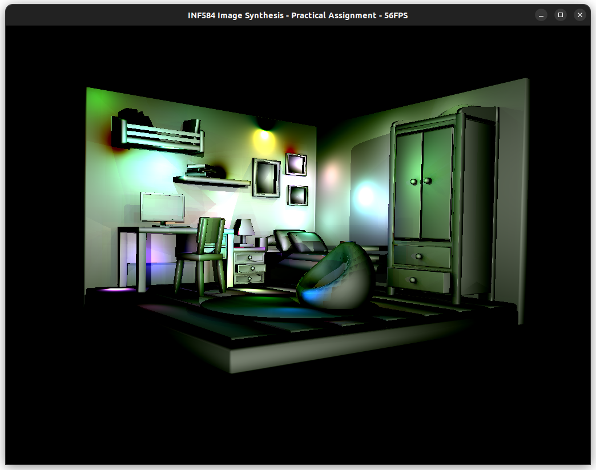|
|bedroom|Lightcuts| 1h47m | 84.6 | 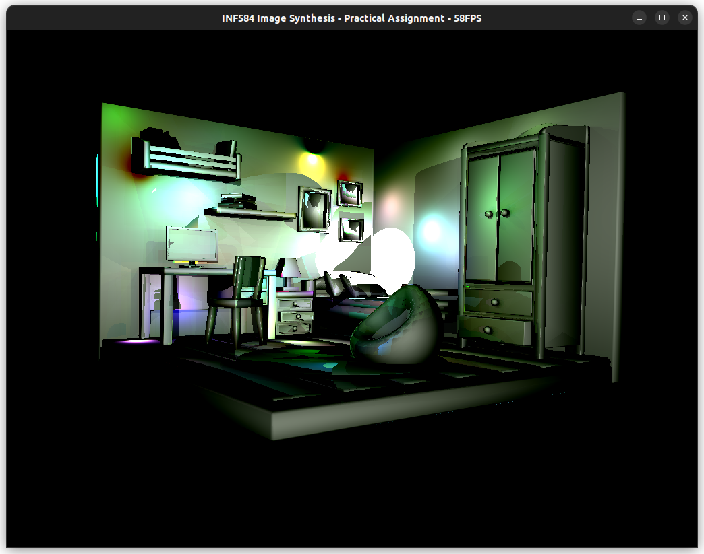|
|bedroom|Lightcuts, only diffuse bounded| 1h58m | 94.4 | 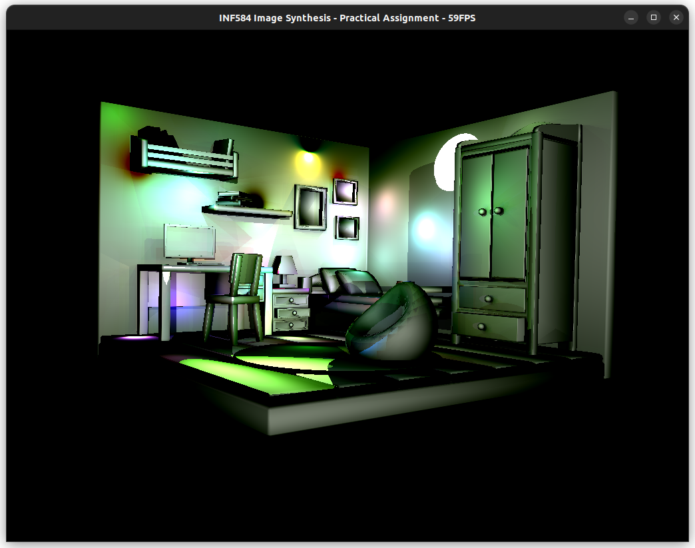|
|bedroom|Lightcuts + sampling | 1h41m | 76.0 | 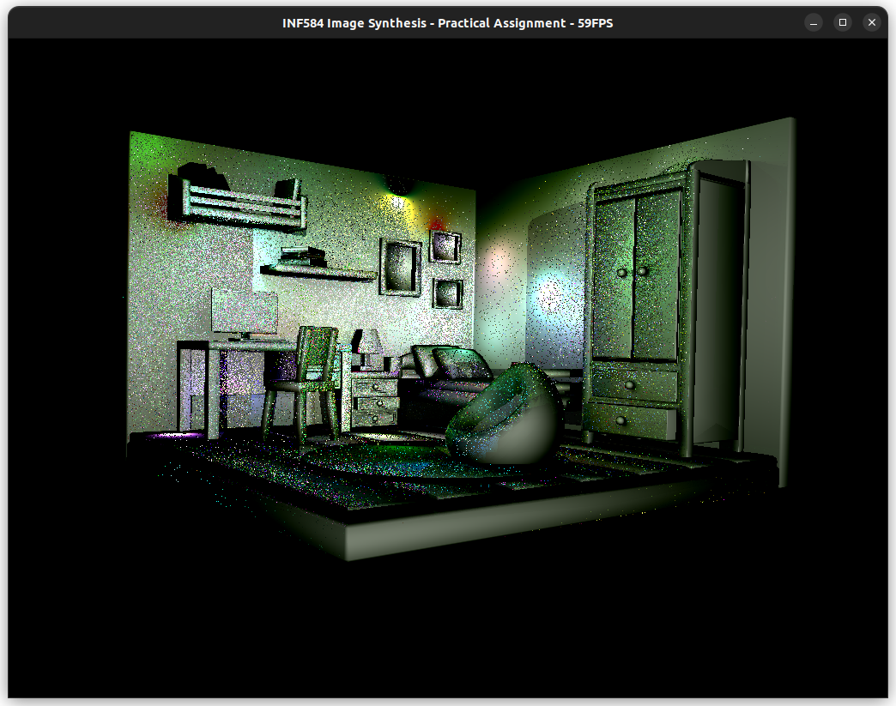| 
|desk|Rasterizer| 0s | 216 | 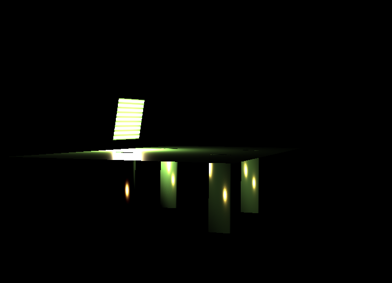|
|desk|Ray tracer| 146s | 216 | |
|desk|Lightcuts| 416s | 107.4 | 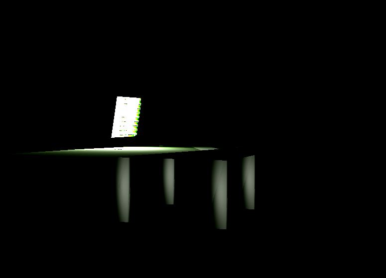|
|desk|Lightcuts, only diffuse bounded| 490s | 126.2 | 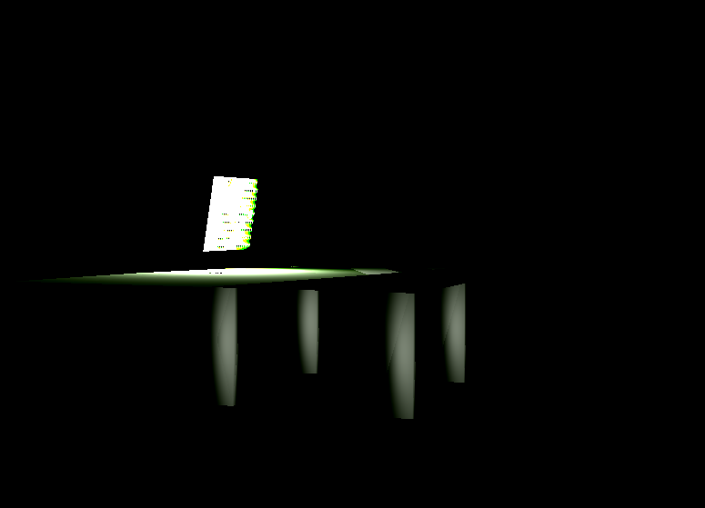|
|desk|Lightcuts + sampling | 462s | 107.7 | 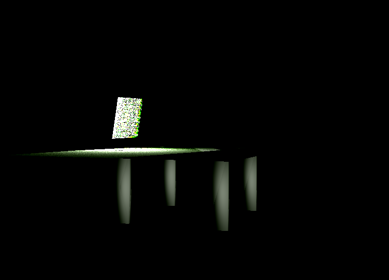|
|desk-red|Rasterizer| 0s | 216 | 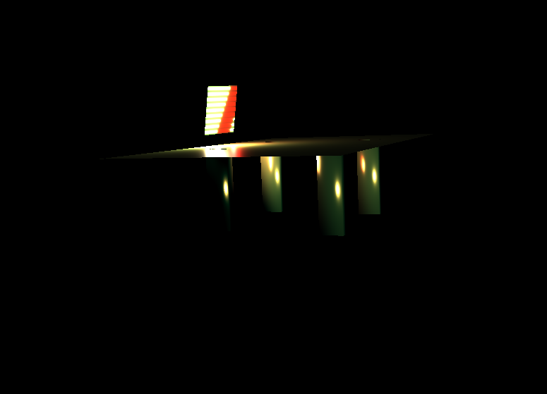|
|desk-red|Ray tracer| 93s | 216 | 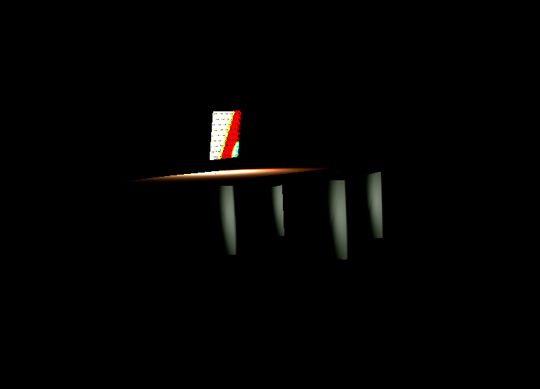|
|desk-red|Lightcuts| 415s | 159.1 | 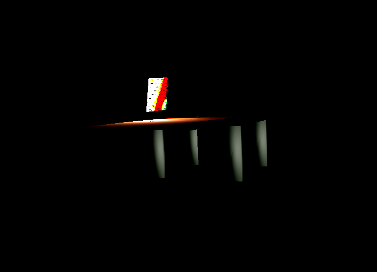|
|desk-red|Lightcuts + sampling| 393s | 132.3 | 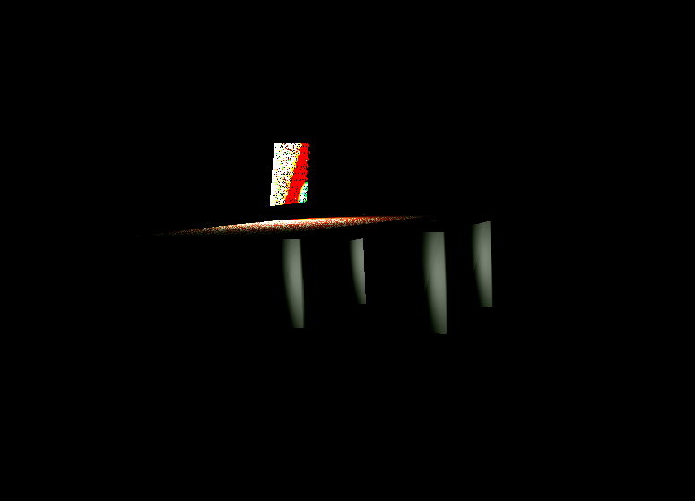|
